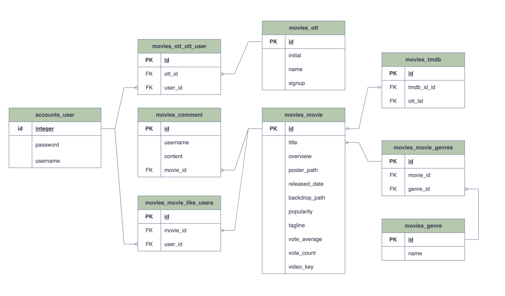
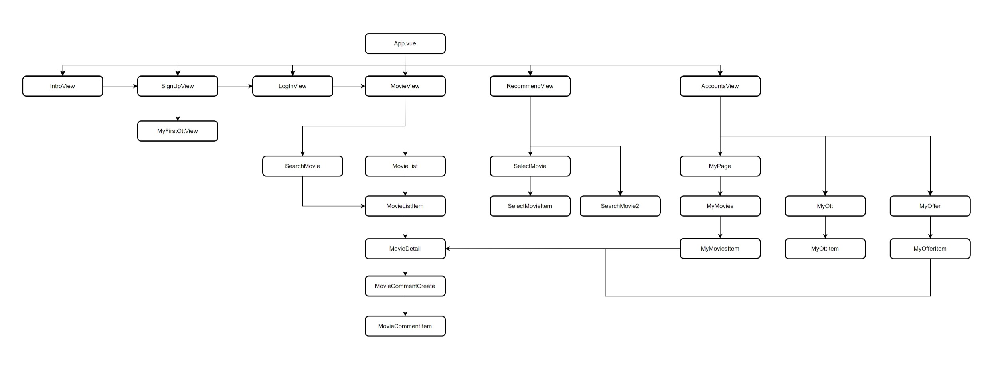

# o . my . tt


> 단 하나의 ott 서비스만 가입할 수 있다면? 난 어떤 서비스에 가입해야 할까? 
에서 시작한 **[o . my . tt]** 입니다.
> 

📌 user가 원하는 영화를 바탕으로 어떤 OTT를 가입해야 하는지 추천

📌 OTT 별로 상영되는 영화 목록 확인 

📌 user가 좋아요한 영화를 바탕으로 영화 추천

---

# A. 개발 단계

## 1. 개발 기간

📆 2023. 05. 15. ~ 2023. 05. 26.

## 2. DB

> JustWatch
> 
- 스트리밍 동영상 검색 엔진 JustWatch 데이터를 이용하여, 2023년 5월 15일 기준 Netflix, Wavve, Watcha, Google Play, Apple TV, Disney Plus에서 제공 중인 영화 콘텐츠를 수집
- 수집한 영화 콘텐츠 별 송출되고 있는 OTT를 리스트 값으로 저장하여 JSON을 구축
- TMDB API를 이용하여 영화 데이터를 추출하고, 이를 위에서 추출한 JSON의 TMDB ID 값과 비교하여, 송출 중인 OTT 데이터가 포함된 MOVIE_DATA.json을 활용

## 3. ERD

> draw.io
> 



---

## 4. API 설계

### 1) main project


### 2) movies app

> movies/
> 


### 3) recommend app

> recommend/
> 


## 5. 파일 구조

### 1) Django

```
back-server
 ┣ accounts
 ┃ ┣ migrations
 ┃ ┃ ┗ __init__.py
 ┃ ┣ __init__.py
 ┃ ┣ admin.py
 ┃ ┣ apps.py
 ┃ ┣ models.py
 ┃ ┣ tests.py
 ┃ ┣ urls.py
 ┃ ┗ views.py
 ┣ final_pjt
 ┃ ┣ __init__.py
 ┃ ┣ asgi.py
 ┃ ┣ settings.py
 ┃ ┣ urls.py
 ┃ ┗ wsgi.py
 ┣ movies
 ┃ ┣ fixtures
 ┃ ┃ ┣ genre.json
 ┃ ┃ ┣ movie_data.json
 ┃ ┃ ┣ ott.json
 ┃ ┃ ┗ ott_offer.json
 ┃ ┣ migrations
 ┃ ┃ ┗ __init__.py
 ┃ ┣ __init__.py
 ┃ ┣ admin.py
 ┃ ┣ apps.py
 ┃ ┣ forms.py
 ┃ ┣ models.py
 ┃ ┣ serializers.py
 ┃ ┣ tests.py
 ┃ ┣ urls.py
 ┃ ┗ views.py
 ┣ recommend
 ┃ ┣ migrations
 ┃ ┃ ┗ __init__.py
 ┃ ┣ __init__.py
 ┃ ┣ admin.py
 ┃ ┣ apps.py
 ┃ ┣ models.py
 ┃ ┣ serializsers.py
 ┃ ┣ tests.py
 ┃ ┣ urls.py
 ┃ ┗ views.py
```

### 2) Vue Component



```
front-server
 ┣ public
 ┃ ┣ favicon.ico
 ┃ ┗ index.html
 ┣ src
 ┃ ┣ assets
 ┃ ┃ ┣ apt.png
 ┃ ┃ ┣ apt_long.png
 ┃ ┃ ┣ brand.png
 ┃ ┃ ┣ cursor.png
 ┃ ┃ ┣ dnp.png
 ┃ ┃ ┣ dnp_long.png
 ┃ ┃ ┣ heart_after.png
 ┃ ┃ ┣ heart_before.png
 ┃ ┃ ┣ loading.gif
 ┃ ┃ ┣ login.jpg
 ┃ ┃ ┣ logo.png
 ┃ ┃ ┣ nfx.png
 ┃ ┃ ┣ nfx_long.png
 ┃ ┃ ┣ ply.png
 ┃ ┃ ┣ ply_long.png
 ┃ ┃ ┣ wac.png
 ┃ ┃ ┣ wac_long.png
 ┃ ┃ ┣ wav.png
 ┃ ┃ ┗ wav_long.png
 ┃ ┣ components
 ┃ ┃ ┣ Accounts
 ┃ ┃ ┃ ┣ MyMovies.vue
 ┃ ┃ ┃ ┣ MyMoviesItem.vue
 ┃ ┃ ┃ ┣ MyOffer.vue
 ┃ ┃ ┃ ┣ MyOfferItem.vue
 ┃ ┃ ┃ ┣ MyOtt.vue
 ┃ ┃ ┃ ┣ MyOttItem.vue
 ┃ ┃ ┃ ┗ MyPage.vue
 ┃ ┃ ┣ MovieList
 ┃ ┃ ┃ ┣ MovieCommentCreate.vue
 ┃ ┃ ┃ ┣ MovieCommentItem.vue
 ┃ ┃ ┃ ┣ MovieDetail.vue
 ┃ ┃ ┃ ┣ MovieList.vue
 ┃ ┃ ┃ ┣ MovieListItem.vue
 ┃ ┃ ┃ ┗ SearchMovie.vue
 ┃ ┃ ┗ Recommend
 ┃ ┃ ┃ ┣ SearchMovie2.vue
 ┃ ┃ ┃ ┣ SelectMovie.vue
 ┃ ┃ ┃ ┗ SelectMovieItem.vue
 ┃ ┣ router
 ┃ ┃ ┗ index.js
 ┃ ┣ store
 ┃ ┃ ┗ index.js
 ┃ ┣ views
 ┃ ┃ ┣ AccountsView.vue
 ┃ ┃ ┣ IntroView.vue
 ┃ ┃ ┣ LogInView.vue
 ┃ ┃ ┣ MovieView.vue
 ┃ ┃ ┣ MyFirstOttView.vue
 ┃ ┃ ┣ RecommendView.vue
 ┃ ┃ ┗ SignUpView.vue
 ┃ ┣ App.vue
 ┃ ┗ main.js
```

---

# B. 개발 도구


- BE: Django
- DB: Sqlite3
- FE: Vue, Vuex
- Server: 

---

# C. 주요 기능

## 0. Sign up & Login

- 회원가입 후 내가 현재 가지고 있는 OTT 리스트 선택하여 저장한다.
- 로그인 후 바로 Home 화면으로 넘어간다.

## 1. Home

### 1) OTT filter

- OTT 버튼을 누르면 해당 OTT에서 상영하는 영화 리스트의 목록 불러오는 기능

### 2) Search

- 내가 원하는 영화 검색 후 영화 포스터를 누르면 movie detail 페이지 들어가는 기능

⚠️ 화면에 영화 리스트를 불러오는 방식이 두 가지이므로 다른 방식을 이용할 경우, 이전에 렌더링 된 리스트를 보이지 않게 구현

### 3) movie detail & community

- movie detail 페이지에서 title, overview, youtube trailer, 해당 영화가 상영되는 OTT가 보여진다.
- 좋아요 및 댓글 기능

---

## 2. OTT recommend

### 1) 영화 선택

> 영화의 선택은 두 가지 버전으로 선택이 가능
> 
1. 랜덤 영화 선택
    1. 초기 화면에서는 전체 영화에서 10개의 영화가 랜덤으로 보여진다.
    2. 원하는 영화가 있다면 선택, 없다면 랜덤 버튼을 눌러 다른 영화를 랜덤으로 가져온다.

1. 검색 기능
    1. 랜덤 영화에서 선택하지 않는다면, 검색창 기능을 통해 user가 원하는 영화를 바로 검색 가능

⚠️ 화면에 영화 리스트를 불러오는 방식이 두 가지이므로 다른 방식을 이용할 경우, 이전에 렌더링 된 리스트를 보이지 않게 구현

### 2) OTT 추천

> user가 선택한 영화의 리스트를 받으면 두 가지의 경우를 고려
> 
1. 리스트 안의 영화가 어느 OTT에서 가장 많이 상영되는지 출력한다. 
2. 단, 이미 user가 사용중인 OTT는 추천하지 않는다.
3. 추천 후 해당 OTT 가입 페이지로 이동 가능

---

## 3. My Page

### 1) 내가 좋아요 한 영화 목록

- user가 좋아요를 누른 영화 목록 불러오기

### 2) 내가 좋아요 한 영화를 기반으로 하는 영화 추천

- user가 좋아요를 누른 영화의 장르가 같은 영화의 목록 중 popularity가 높은 영화 15개 추천

### 3) 나의 ott 리스트 목록 수정 기능

- 회원가입 시에 저장했던 user가 가입되어 있는 OTT 목록이 보이며, 변동사항이 생긴 경우 변경 후 저장할 수 있다.

---

# D. **Cooperation**


---

# E. Review

### 👩‍💻 박영서

1. 기획의 중요성

첫 프로젝트를 진행하면서 가장 어려웠던 점은 우리가 어디까지 구현할 수 있을 까?에 대한 의문이었습니다. 그래서 무언가를 하겠다고 정하기 보다도 진행하면서 덧붙이는 방식으로 진행되었습니다. 이로 인해 모델을 수정하거나 vuex를 활용하지 않았다가 다시 활용하면서 정의한 함수를 옮기는 일이 발생하였습니다. 따라서 서비스의 정체성을 정하고 기능 구현에 대한 관계 설정을 구축하고 시작하는 것에 대한 중요성을 느꼈습니다.

2. 백엔드와 프론트엔드의 경계

프로젝트를 시작하기 전에는 백엔드와 프론트엔드 사이의 경계를 명확하게 생각했습니다. 하지만 postman을 통해서만 백서버에서의 코드를 짜기란 어려웠습니다. 이로 인해 서서히 vue에 내가 원하는 결과가 보이는지 확인하는 과정을 거쳤습니다. 그래서 백엔드와 프론트엔드 사이의 경계란 무엇인지 의문이 생겼고, 역할에 대한 이해가 아직 부족하다고 생각했습니다.

3. 짧은 시간에서의 발전

이게 될까..? 라고 생각하며 시작한 프로젝트였지만 시간이 지나면서 문제를 해결하기 위해 집중하고 여러방면으로 성장하는 모습을 발견할 수 있었습니다. 프로젝트를 시작하기 전에는 최소한의 기능을 구현만 했으면 좋겠다고 생각했지만 진행하면서 욕심이 생겨 하나 둘씩 추가하면서 재미를 느낄 수 있었습니다.

4. 협업 및 소통

프로젝트는 정말 팀원과의 협업이 중요한 문제임을 느꼈습니다. 서비스의 배경색 하나를 정하는 것 부터 팀원과의 소통이 중요함을 깨달았습니다. 제 아이디어를 적극 따라주고, 아이디어가 있다면 건의해주고, 에러가 발생하면 같이 잡아주고, 기능을 상상 이상으로 구현해준 페어에게 감사했습니다. 

### 👩‍💻 배희진

1. 총평

확실히! 프로젝트는 계획이 반이라는 말이 사실임을 절실히 느꼈다. 꼼꼼한 페어와 함께 프로젝트를 진행하였으나, 기존에 계획한 것과 충돌하는 이슈가 발생할 때, 생각했던 것보다 많은 시간을 할애하게 되어 프로젝트 진행에 차질이 있었다. (예. ERD 구조도, Componenet 구조, git branch 등) 훌륭한 테크리더 덕분에 무사히 마무리할 수 있었지만, 본격적인 2학기 프로젝트를 위해서는 DJango, Vue를 복습하는 시간을 가져야 한다고 생각한다.

2. Back-End

백엔드 개발자가 되기 위해서는 알고리즘과 CS 지식이 중요하다고 생각하였는데, 이번 프로젝트를 통해, 서버의 구조를 파악하고 가장 효율적으로 데이터를 구축 및 전달하는 것 역시 중요하다는 것을 알게 되었다. `Serializer`를 이용하여 올바른 필드값을 프론트 단으로 전송할 수 있도록 하는 것 등, 프론트엔드 개발자의 원활한 작업을 위해 백엔드 개발자가 신중하게 재료를 주어야 한다는 것을 배웠다.

3. Front-End

‘프론트엔드’라는 것이 무엇인지 배울 수 있었다. 단순히 유저가 보는 화면을 예쁘게 꾸미는 것은 그들이 하는 일의 일부에 지나지 않았고, API 또는 데이터로부터 올바른 요청을 받아 올바른 결과값을 적절한 UI로 보여주는 것이 프론트엔드 개발자의 역할이었다. CSS는 요청 값을 가독성 좋게 해주는 포장지 역할이었고, 진또배기는 데이터 요청이라는 것을, 콘솔창이 빨갛게 물들어갈 때마다 절실하게 느꼈다.

4. 리더에게

부족한 팀원 이끌어줘서 고맙습니다. 확실히 이론과 실전은 차이가 있더군요. 단순히 필기 복습 위주로 공부했던 지난 날을 돌이켜 보는 시간을 가졌습니다. 2학기 프로젝트에서도 힘내봅시다.

5. 교수님께

한 학기 동안 3반 학생으로 지낼 수 있어서 행복했습니다.
hihi
---
